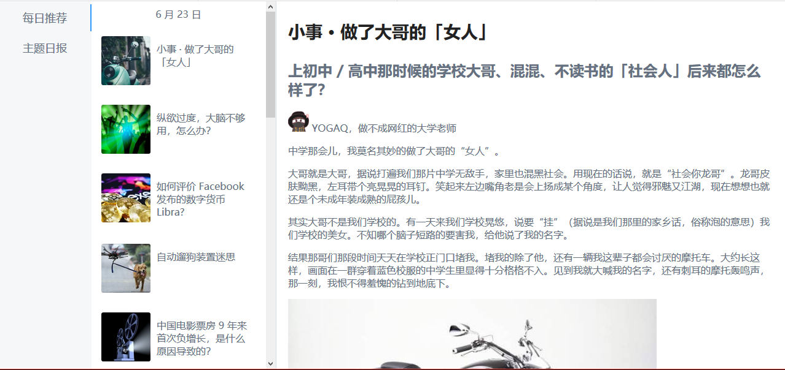

## 启动项目

1. 启动代理服务器

   node proxy.js

2. 启动项目

   npm run dev

   

> 这里的 themes 主题 API 挂了（主题日报无页面），暂时没找到相应的 API 接口。

## 视图

布局为纵轴三栏视图，第一栏为每日推荐和主题日报，第二栏为相应类型的文章列表视图，第三栏为已选择的文章详细内容视图。

## 功能

1. 每日推荐

   每日推荐列表视图滚动加载更多以前的内容。

2. 请求，响应拦截

   使用 `axios` 库，创建请求，创建响应拦截，对数据进行处理，请看 `util.js`。